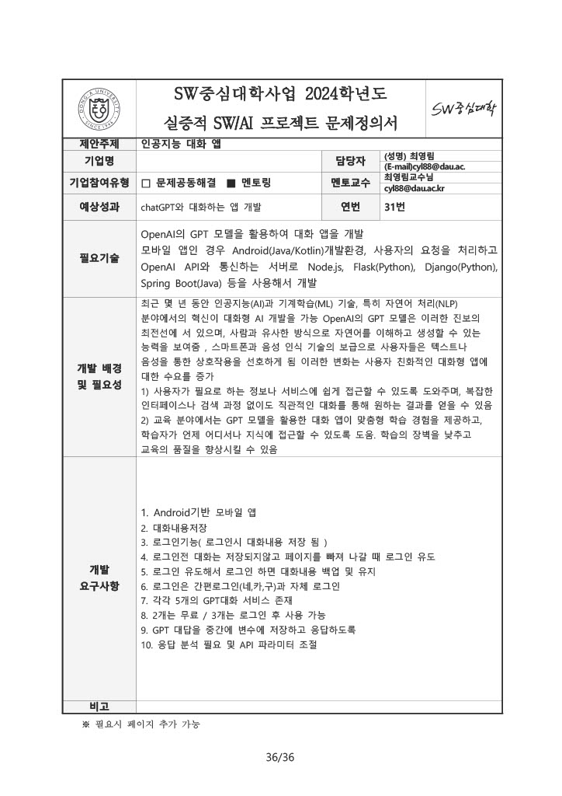

# 프로젝트 주제
> 인공지능 chat App 개발
> 
> [현재진행상황](#현재진행상황)

## 목표
1. 기존 생성형 인공지능과 달리, 한 가지 기능에 특화된 인공지능을 개발하여 사용자에게 정확한 정보 전달하도록 함
2. gpt api를 활용하여 Chat app을 개발

우리는 영화에 특화된 인공지능을 개발하기로 함

# 팀원
> 김성재(팀장), 고태현, 나우루즈벡 압둘라, 이하린

## 역할
+ 김성재: aws 서버 구축
+ 고태현: api 개발
+ 나우루즈벡 압둘라:
+ 이하린: api 개발

# 기술스택
Flutter, AWS, openAI API, MySQL DB

# 개발현황
[API](./api)

## 현재진행상황
5/12
> gpt-4-turbo api로 검색 기능을 사용하려 하였으나, 검색이 불가능한 문제점 발견
> 
> 대체 방안으로 1) GPTs와 OpenAI assistant 결합(고태현), 2) gpt fine-tuning api와 google search api 결합(이하린)
> 
> 1)과 2) 총 두 가지 방법을 테스트할 예정
> 
> 개발과 동시에 api를 사용할 수 있도록 AWS 서버 구축(김성재)도 동시에 진행함

6/3
> Flutter App 개발 진행 중 (고태현)
> 
> GPTs와 assistant로 개발 진행 중 (이하린)
> 
> gpt fine-tuning은 gpt 속도를 고려하여 추후 사용할지 말지 고려
> 
> 외부 API를 결합한 gpt 모델과 서버리스 api 개발 중 (김성재)

6/9
> Flutter App 베타 버전 개발 완료 (고태현)
>
> App과 각각의 API 연동 완료 (김성재)
>
> GPTs(dami) 베타 버전 개발 완료 (이하린)
>
> App 테스트 중 발생하는 오류 수정 중(GPT 응답 실패 등)
>
> 영화 추천 알고리즘 개발 및 테스트 중 (나우루즈벡 압둘라)
