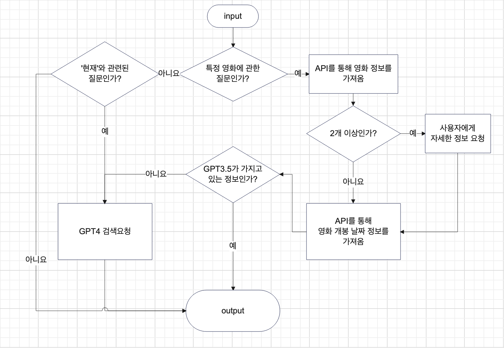

# GPT API


## GPT API Flow Chart



## api 핵심
1. gpt 3.5와 gpt 4을 함께 사용
2. gpt 4의 검색 기능을 활용하여 최신 정보 확보


## gpt api 사용하기 - python
1. openAI에서 api key 발급
2. openAI 라이브러리 설치
3. api key는 환경변수로 처리
   
(사용예시)
```python
import os
from openai import OpenAI

client = OpenAI(
    # api key를 환경 변수로 설정
    api_key=os.environ.get("OPENAI_API_KEY"),
)

system_message = {
    "role": "system",
    "content": "넌 영화에 대해서 알려주는 도우미야."
}

user_message = {
    "role": "user",
    # 요청하는 정보
    "content": "영화 기생충에 대해서 알려줘"
}

chat_completion = client.chat.completions.create(
    messages=[
        system_message, user_message
    ],
    model="gpt-3.5-turbo",
)

print(chat_completion.choices[0].message.content)
```
(출력결과)
> "기생충"은 2019년 개봉한 대한민국의 영화로, 봉준호 감독이 연출하고 각본을 썼습니다. 이 영화는 한 가족이 빈곤한 가정의 다른 가족들을 기생충처럼 이용하면서 벌어지는 이야기를 다룹니다.
> 봉준호 감독의 유쾌하고 예리한 플롯 전개, 캐릭터의 복잡한 심리 묘사, 사회 비판적 요소 등이 매우 높은 평가를 받았으며, 수많은 시상식에서 수상을 기록하며 한국 영화 역사상 최고의 작품 중 하나로 꼽힙니다.
> "기생충"은 스릴러와 블랙 코미디의 요소를 혼합하여 관객들에게 긴장감과 웃음을 한꺼번에 선사하는 작품이라고 할 수 있습니다. 또한 사회적인 메시지와 섬세한 캐릭터들의 묘사로 많은 이들의 관심을 끌었습니다.


## 문제점
### gpt 4의 검색기능을 활용하여 최신정보 가져오기로 하였지만, gpt api는 검색 기능이 없음
+ chat gpt에서 gpt 4을 사용할 시, browser 기능을 사용하여 검색하게 됨
   + 이는 openAI에서 제공하는 기능이므로 api를 사용할 때는 browser 기능 사용불가
### 해결방법 - 외부 api와 결합하여 검색 기능을 구현하자
+ api를 통해 검색하여 가져온 데이터를 gpt에게 넘겨주어 답변을 받는다
+ 사용할 api: google search API


## goole search API 사용하기 - python
https://developers.google.com/custom-search/v1/introduction?apix=true&hl=ko
1. 위 사이트를 참조하여 ID와 API KEY를 받아온다. - 환경변수로 처리
2. 검색할 사이트는 3개(google.com, naver.com, daum.net)로 구성함
3. requests 라이브러리 설치

(사용예시)
```python
import os
import requests

# google search
Google_SEARCH_ENGINE_ID = os.environ.get("GSE_ID")  # Search Engine ID
Google_API_KEY = os.environ.get("GOOGLE_API_KEY")  # Custom Search Engine API KEY
query = "쿵푸팬더4 개봉일"  # 검색할 쿼리
start_page = "1"  # 검색할 페이지 설정. 한 페이지당 10개 가져올 수 있음

url = f"https://www.googleapis.com/customsearch/v1?key={Google_API_KEY}&cx={Google_SEARCH_ENGINE_ID}&q={query}&start={start_page}"

response = requests.get(url).json()

output = response["items"]

for out in output:
    print(out["snippet"])
```
(실행결과)
> 카테고리 이동 인생은 비스킷통이다 · 검색. MY메뉴 열기. 영화or뮤지컬. 쿵푸팬더4 개봉일 무료 팝콘 이벤트. 프로필 · 지지배. 2024. 3. 28. 13:35. 이웃추가.
> Jul 26, 2023 ... 카테고리 이동 Wondrous Gamer! ... - 이번 영화는 기존 쿵푸 팬더의 배경인 평화의 계곡을 넘어 대도시로 향하는 포의 모험을 담는다. - 이번 빌런은 악당 ...
> Apr 10, 2024 ... 4월 10일 어린이들을 위한 최고의 선물이라 할 수 있는 영화 <쿵푸팬더4>가 개봉했습니다. 이 작품은 1~3편이 국내 애니메이션 박스오피스 역대 TOP10 ...
> Apr 8, 2024 ... 전세계적으로 사랑을 받는 시리즈죠. <쿵푸팬더4>가 국내 개봉을 앞두고 있습니다. 전작 이후로 8년만에 돌아온 후속작이라 할 수 있는데요.
> Apr 11, 2024 ... ... 개봉일에 40만명을 훌쩍 넘는 관객을 모아 박스오피스 정상에 올랐다. 11일 영화관입장권 통합전산망에 따르면 '쿵푸팬더 4'는 개봉일이자 총선으로 ...
> Apr 5, 2024 ... 최근 <쿵푸팬더4> 상영 전 자사의 기대작들을 예고편과 함께 발표했습니다. 어떤 작품들이 있었는지 예고편과 함께 살펴봅니다. 쿵푸팬더4. ✓개봉일: 4 ...
> Mar 31, 2024 ... <오멘: 저주의 시작> - 개봉일 : 4월 3일 예정 - 장르 : 공포 / 등급 : 15세 관람가 - 감독 : 아르카샤 스티븐슨 - 출연 : 넬 타이거 프리, ...
> Mar 24, 2024 ... 애니메이션 극장판이라고 하면 떠오르는 유명한 작품 쿵푸팬더. 2024년 4월 10일 쿵푸팬더 4가 한국에 개봉한다고 하여 다양한 시리즈가 나온 쿵푸 ...
> Apr 4, 2024 ... ... 목소리: 잭 블랙 (포), 아콰피나 (렌), 비올라 데이비스(카멜레온), 더스틴 호프만 (시푸). 개봉일: 2024년 4월 10일.
> Apr 13, 2024 ... '4를 만든다면 그때는 세식구가 보러갈 수 있으려나. ' 썼었네요. ​. ​. 소오름. 진짜 이제는 아이가 커서 우리보다 먼저 개봉일을 알고 자기가 먼저 < ...


## gpt api와 google search api 결합
+ 위에서 google search api를 통해 가져온 내용을 gpt api에게 넘겨주며 질문한다.

결합한 코드
```python
import os
from openai import OpenAI
import requests

# google search
Google_SEARCH_ENGINE_ID = os.environ.get("GSE_ID")  # Search Engine ID
Google_API_KEY = os.environ.get("GOOGLE_API_KEY")  # Custom Search Engine API KEY
query = "쿵푸팬더4 개봉일"  # 검색할 쿼리
start_page = "1"  # 검색할 페이지 설정. 한 페이지당 10개 가져올 수 있음

url = f"https://www.googleapis.com/customsearch/v1?key={Google_API_KEY}&cx={Google_SEARCH_ENGINE_ID}&q={query}&start={start_page}"

response = requests.get(url).json()

output = response["items"]

info = ""

for out in output:
    info += out["snippet"]

client = OpenAI(
    # This is the default and can be omitted
    api_key=os.environ.get("OPENAI_API_KEY"),
)

system_message = {
    "role": "system",
    "content": "넌 영화에 대해서 알려주는 도우미야. 추가적으로 제공하는 정보를 바탕으로 알려줘"
}

user_message = {
    "role": "user",
    "content": "쿵푸팬더4 개봉일에 대해서 알려줘 정보: " + info,
}

chat_completion = client.chat.completions.create(
    messages=[
        system_message, user_message
    ],
    model="gpt-3.5-turbo",
)

print(chat_completion.choices[0].message.content)
```

### api 결합 전 후 차이점(쿵푸팬더4 개봉일 요청하기)
(결합 전 실행결과)
> 쿵푸 팬더 4(Kung Fu Panda 4)는 2024년 3월 8일에 개봉할 예정입니다. 이 영화는 유명한 애니메이션 "쿵푸 팬더" 시리즈의 네 번째 작품으로, 팬들이 기대하는 작품 중 하나입니다.

(결합 후 실행결과)
> 영화 "쿵푸팬더 4"의 개봉일은 2024년 4월 10일입니다.

## 유지보수
1. 어떠한 경우에 검색을 해야하는지에 대한 정교한 알고리즘 필요
2. google search api를 사용할 때, 더욱 정확한 정보를 가져오기 위한 요청 메서드 정교화 필요
